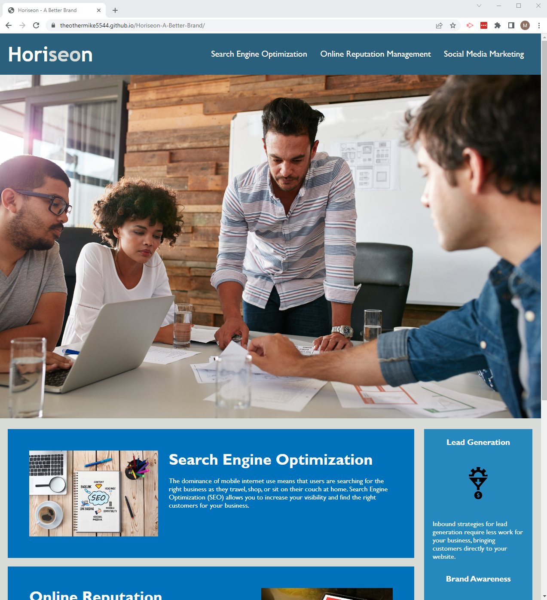

## Horiseon-A-Better-Brand
<!-- UPDATED FOR RESUBMISSION-->
Marketing Agency needed revisions to their site's codebase that follows accessibility standards so that their our own site is optimized for search engines. I have refactored this code to provide better organization and consolidated code to improve the code for future developers to come. See below for my breakdown of what was executed!

## Acceptance Criteria
GIVEN a webpage meets accessibility standards  </br>
WHEN I view the source code  </br>
THEN I find semantic HTML elements  </br>
WHEN I view the structure of the HTML elements  </br>
THEN I find that the elements follow a logical structure independent of styling and positioning  </br>
WHEN I view the image elements  </br>
THEN I find accessible alt attributes  </br>
WHEN I view the heading attributes  </br>
THEN they fall in sequential order  </br>
WHEN I view the title element  </br>
THEN I find a concise, descriptive title  </br>

## Executed Plan of Action
```
Updates include:
Restructuring of div elements into semantic formatting of html file code
Consolidation and better practices of css styling code
Correcting issues on written code whether it was missing punctuation or linked references ie. search engine optimization section.
Adding alt attributes to all images
Added anchor element to header
Commented beginning and end of categories of html code and css style sheet
Re-utilized css formatting to reference index.html semantic code
Hosted Site Link
Added Title element
All code now follows proper sequential order
```
## Live URL Link 

https://theothermike5544.github.io/Horiseon-A-Better-Brand/

## Screenshot of Site


## Screenshot of Working Site

